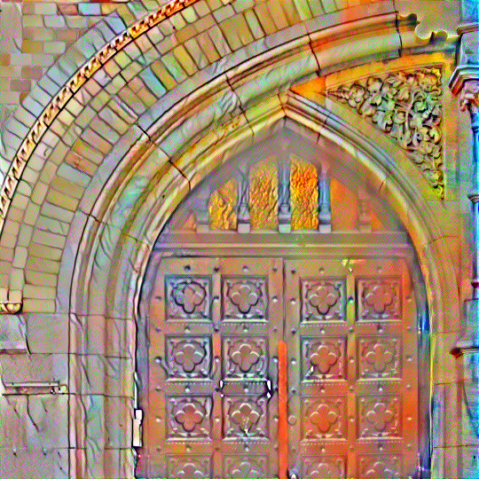

# Style Transfer Mural Generator

This app generates a mural using style transfer. Upload an image and select the styles to apply to the image. The app will generate a mural using the style transfer technique.

Built with Gradio and PyTorch.
